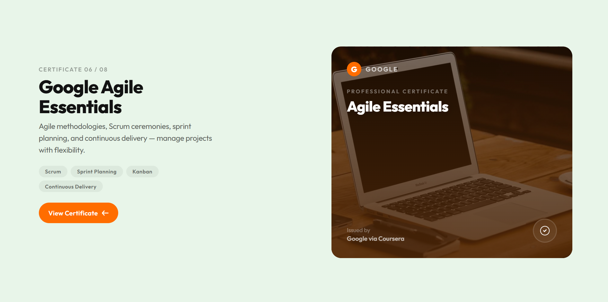

# GSAP Image Mask Reveal on Scroll

A smooth **scroll-driven image mask reveal animation** built with **GSAP** and **ScrollTrigger**. This project creates a cinematic pinned section where the image is progressively revealed as the user scrolls, producing a modern landing-page style interaction.

## Preview

### Screenshot 1



### Screenshot 2


## Features

* Scroll-based image reveal effect
* Pinned section powered by **GSAP ScrollTrigger**
* Smooth mask / reveal animation
* Immersive modern landing-page interaction
* Lightweight front-end implementation
* Easy to customize for portfolios, product pages, and creative websites

## Built With

* **HTML**
* **CSS**
* **JavaScript**
* **GSAP**
* **GSAP ScrollTrigger**

## How It Works

This animation uses **GSAP ScrollTrigger** to:

1. Pin a section while the user scrolls
2. Animate the image mask / reveal effect
3. Sync the animation progress with the page scroll
4. Create a smooth storytelling-style visual experience

This type of effect is commonly used in:

* Portfolio websites
* Product showcase pages
* Agency landing pages
* Creative hero sections
* Interactive storytelling layouts

## Getting Started

### 1. Clone the repository

```bash
git clone https://github.com/the-lazyguy/image-mask-reveal-on-scroll.git
```

### 2. Open the project

Open the project folder in **VS Code** or any code editor.

### 3. Run locally

You can simply open the HTML file in your browser, or use a local development server like **Live Server** for a better development experience.

## Project Structure

```bash
image-mask-reveal-on-scroll/
├── Specialization.html
├── 1.png
├── 2.png
└── README.md
```

## GSAP Setup

Make sure **GSAP** and **ScrollTrigger** are included in your project.

Example CDN setup:

```html
<script src="https://cdn.jsdelivr.net/npm/gsap@3/dist/gsap.min.js"></script>
<script src="https://cdn.jsdelivr.net/npm/gsap@3/dist/ScrollTrigger.min.js"></script>
```

## Customization

You can easily modify:

* Image size and positioning
* Mask reveal speed
* Scroll distance
* Pin duration
* Section layout and spacing
* Animation easing
* Responsive behavior

## Use Cases

This animation works well for:

* Portfolio hero sections
* Product presentation pages
* Agency websites
* Interactive storytelling sections
* Premium landing pages

